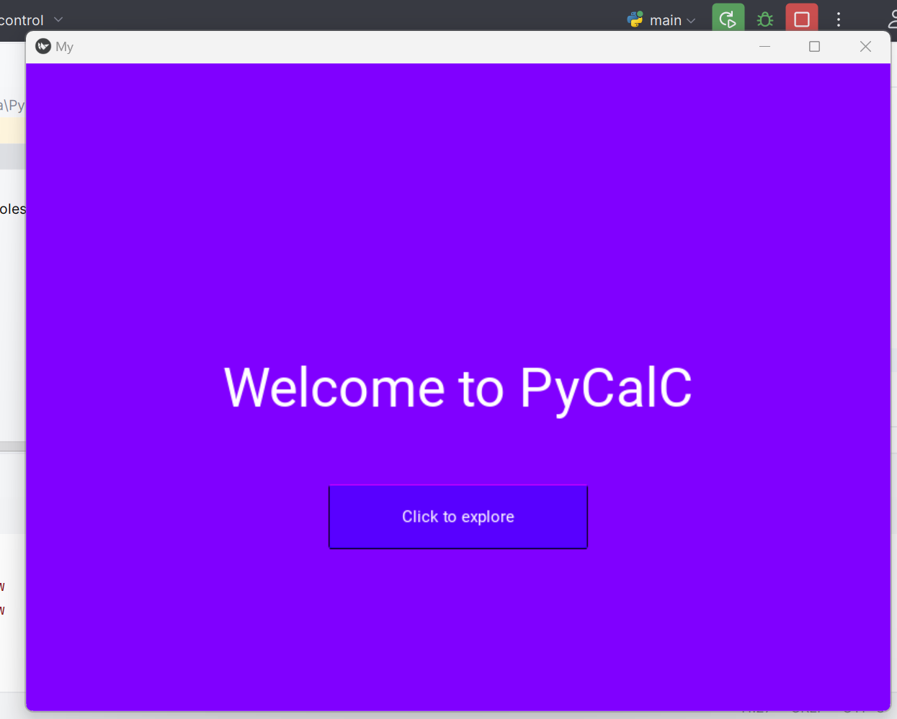

# Calculator App

This is a simple calculator application built using Python and Kivy framework.

## Developer

This project was developed by Shanmugapriya.

## Features

- Perform basic arithmetic operations: addition, subtraction, multiplication, and division.
- Input numbers using a numeric keypad or the computer keyboard.
- Display the result of the calculations on the screen.

## Prerequisites

- Python 3.x
- Kivy

## Installation

1. Clone the repository:

## Usage

1. Run the `main.py` file:
2. Use the numeric keypad or computer keyboard to input numbers.
3. Use the buttons on the calculator interface to perform arithmetic operations.
4. The result of the calculations will be displayed on the screen.

## Screenshots

## Screenshots

## Contributing

Contributions are welcome! If you find any issues or have suggestions for improvement, please feel free to submit a pull request.

## License

You are free to use, modify, and distribute this project. See the [LICENSE](LICENSE) file for more details.
